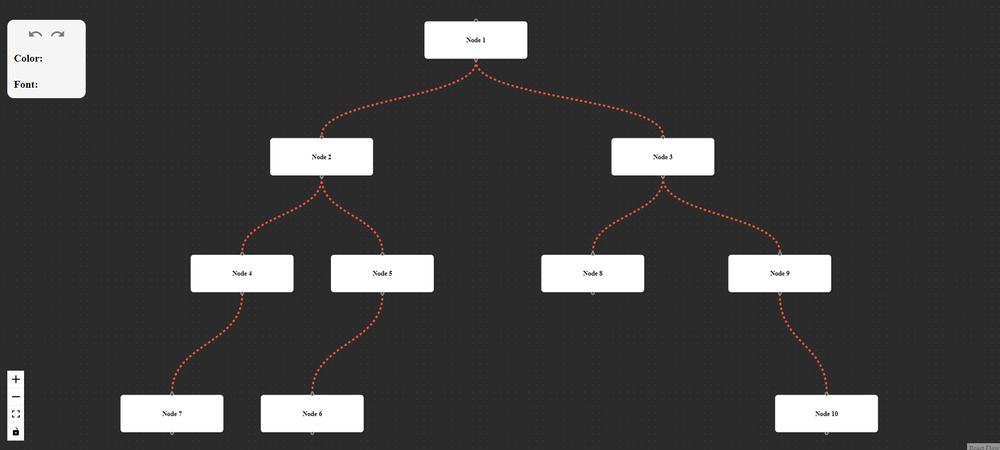

# Graph Visualization App

A React-based application for visualizing dynamic and interactive graphs.

---

## **Setup Instructions**

### **Clone the Repository**
To set up the project locally, follow these steps:

1. Clone the repository:
   ```bash
   git clone https://github.com/dev-shubham01/GraphVisual.git
   cd GraphVisual
2. Install Dependencies
   --npm install
   --npm run dev
   
This will properly clone the repository, install the necessary dependencies, and start the development server.


## Dependencies

The project uses the following libraries:

## Dependencies
The project relies on the following key libraries:

### **Main Dependencies**
1. **React** (`^18.2.0`) - JavaScript library for building user interfaces.
2. **React Redux** (`^9.2.0`) - Official React bindings for Redux.
3. **Redux Toolkit** (`^2.5.1`) - A library for efficient and scalable Redux development.
4. **React Flow Renderer** (`^10.3.17`) - Library for building node-based graphs and flow diagrams in React.
5. **Material UI Icons** (`^6.4.3`) - Material Design icons for React applications.
6. **Lodash** (`^4.17.21`) - A modern JavaScript utility library for handling arrays, objects, and other data types.


### **Basic Usage Guide**

- **Drag Nodes**: You can click and drag any node to reposition it anywhere on the canvas.
  
- **Customization Panel**: 
  - Located at the top left corner of the canvas, the customization panel allows you to make changes to the nodes.
  - **Undo and Redo**: Use the "Undo" and "Redo" buttons to revert or reapply any changes made to the nodes.
  - **Color and Font Options**: Below the undo/redo buttons, you will find options to change the color and font size of nodes.
  
- **Node Customization**: 
  - When you click on a node, the customization panel will update to reflect the selected node.
  - From the panel, you can change the **color** and **font size** of the node to your preference.

  
- **Screenshot**:

